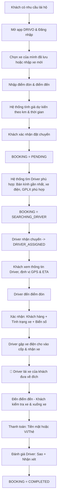
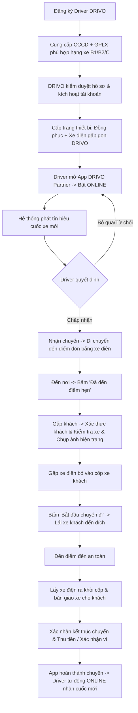

# 🚗 DRIVO — TỔNG HỢP TOÀN BỘ LUỒNG NGHIỆP VỤ & HỆ THỐNG

> **DRIVO** là nền tảng kết nối **Khách hàng** có xe ô tô nhưng không thể/không muốn tự lái (uống rượu bia, say xỉn, mệt mỏi, bận việc) với **Tài xế chuyên nghiệp** đến lái hộ xe của khách về tận nhà.

---

## 💡 ĐIỂM ĐẶC BIỆT & GIẢI PHÁP ĐỘT PHÁ CỦA DRIVO

### 🚲 Bài toán di chuyển của Tài xế: **"Xe điện gấp gọn DRIVO"**
- **Vấn đề của mô hình lái hộ truyền thống:** Tài xế đi xe máy đến đón khách thì xe máy của tài xế bỏ ở đâu? Hoặc phải đi 2 người (1 người chở, 1 người lái) làm tăng gấp đôi chi phí nhân sự.
- **Giải pháp của DRIVO:** 
  1. DRIVO trang bị cho mỗi Tài xế một chiếc **xe điện thông minh có thể gấp siêu gọn**.
  2. Tài xế dùng xe điện di chuyển nhanh chóng đến điểm hẹn của Khách.
  3. Gặp Khách: Tài xế gập gọn xe điện và **đặt vào cốp xe ô tô của Khách**.
  4. Tài xế lái xe của Khách đưa Khách về đến điểm đích an toàn.
  5. Đến nơi: Tài xế lấy xe điện ra khỏi cốp, bàn giao xe cho Khách, nhận tiền/thanh toán.
  6. Tài xế lại mở xe điện ra, bật app sang trạng thái **ONLINE** sẵn sàng nhận cuốc mới tiếp theo!

---

## 1. 👤 CHI TIẾT LUỒNG KHÁCH HÀNG (CUSTOMER FLOW)

### Các bước cụ thể:
1. **Khởi tạo nhu cầu:** Khách uống rượu bia/mệt mỏi, mở ứng dụng DRIVO.
2. **Chọn phương tiện:** Chọn xe trong danh sách xe đã lưu (hoặc thêm xe mới: Sedan/SUV/Bán tải/Số sàn hay tự động, biển số xe).
3. **Nhập lộ trình:** Chọn điểm đón (GPS hiện tại) và điểm trả xe (nhà riêng/khách sạn).
4. **Báo giá & Xác nhận:** Xem giá cước trọn gói dự kiến (tính theo km, thời gian ban đêm, phụ phí lễ tết). Bấm **"Đặt tài xế"**.
5. **Theo dõi đón:** Theo dõi vị trí tài xế di chuyển bằng xe điện đến điểm đón qua bản đồ realtime.
6. **Bàn giao xe:** 
   - Kiểm tra thông tin tài xế (hình ảnh, họ tên, đồng phục DRIVO).
   - Cùng tài xế kiểm tra nhanh ngoại quan xe (tránh tranh chấp vết xước có từ trước).
   - Mở cốp để tài xế để xe điện gấp vào.
7. **Di chuyển:** Ngồi nghỉ ngơi trên chính chiếc xe của mình để tài xế đưa về.
8. **Hoàn thành & Đánh giá:** Về tới nơi, nhận lại xe, thanh toán và chấm điểm dịch vụ.

---

## 2. 🚖 CHI TIẾT LUỒNG TÀI XẾ (DRIVER FLOW)

### Yêu cầu đặc thù của Tài xế DRIVO:
- **Bằng lái (GPLX):** Tối thiểu B2 còn hạn, tay lái vững, thông thạo xe số tự động lẫn số sàn.
- **Kỹ năng kiểm tra xe:** Biết kiểm tra nhanh tình trạng xe trước khi nổ máy (vết trầy xước, phanh, nhiên liệu, đồ đạc trong xe).
- **Vận hành xe điện gấp:** Bảo quản, sạc pin xe điện đầy đủ trước ca trực để đảm bảo bán kính cơ động.

---

## 3. 🔄 SỰ GIAO NHAU GIỮA 2 FLOW (TRIP LIFECYCLE)

| Giai đoạn | Trạng thái Booking | Hành động Khách hàng | Hành động Tài xế |
| :--- | :--- | :--- | :--- |
| **1. Khởi tạo** | `PENDING` | Tạo cuốc, chọn điểm đón/đến | Đang `ONLINE` chờ cuốc |
| **2. Điều phối** | `SEARCHING_DRIVER` | Chờ hệ thống match | Nhận thông báo cuốc xe |
| **3. Khớp lệnh** | `DRIVER_ASSIGNED` | Xem vị trí tài xế & ETA | Nhận cuốc, mở xe điện chạy tới |
| **4. Tiếp cận** | `DRIVER_ARRIVED` | Nhận thông báo tài xế đã tới | Đến nơi, bấm thông báo đã tới |
| **5. Bàn giao** | `PICKUP` | Mở cốp, giao chìa khóa | Gấp xe điện vào cốp, chụp ảnh xe |
| **6. Đang chạy** | `IN_TRANSIT / STARTED`| Ngồi thư giãn trên xe | Lái xe khách theo lộ trình Map |
| **7. Đến nơi** | `ARRIVED_DESTINATION` | Chuẩn bị xuống xe | Dừng đỗ xe an toàn, mở cốp lấy xe điện |
| **8. Thanh toán** | `PAYMENT_PENDING` | Quẹt thẻ/Ví hoặc trả tiền mặt | Xác nhận đã nhận tiền |
| **9. Hoàn tất** | `COMPLETED` | Chấm sao, nhận xét | Tự động về lại `ONLINE` nhận cuốc |

---

## 4. 🗄️ ÁNH XẠ DỮ LIỆU CSDL (DATABASE MAPPING)

- **`Users` / `Customers`**: Quản lý tài khoản khách hàng, điểm uy tín, lịch sử gọi xe.
- **`Drivers` / `DriverVehicles`**: Quản lý bằng lái, CCCD, trạng thái xe điện gấp được cấp (Mã xe điện, dung lượng pin, tình trạng bảo dưỡng).
- **`CustomerVehicles`**: Danh sách xe ô tô của khách (Hãng xe, model, màu sơn, biển số, loại hộp số AT/MT).
- **`Bookings` / `Trips`**:
  - Lưu tọa độ Pickup/Dropoff.
  - Tình trạng kiểm tra xe (Ảnh chụp trước chuyến đi `PreTripInspectionPhotos`).
  - Lộ trình di chuyển GPS tracking (`TripLocations`).
- **`Payments` & `DriverWallets`**:
  - Tự động trừ tiền ví / chia tỷ lệ hoa hồng giữa DRIVO và Tài xế (ví dụ: Tài xế 80% - Nền tảng 20%).
- **`Ratings`**:
  - Khách đánh giá tài xế (thái độ lái xe, cẩn thận, bảo quản xe).
  - Tài xế đánh giá khách hàng.

---

## 5. 🚀 CÁC TÍNH NĂNG MỞ RỘNG TIỀM NĂNG CHO DRIVO
1. **Bảo hiểm chuyến đi (Trip Insurance):** Tự động kích hoạt gói bảo hiểm thân vỏ xe trong suốt thời gian tài xế DRIVO cầm lái.
2. **Camera hành trình tích hợp:** Cho phép tài xế bật camera trên app ghi lại quá trình lái xe để bảo vệ quyền lợi đôi bên.
3. **Quản lý trạm sạc & đổi pin xe điện:** Mạng lưới hỗ trợ tài xế sạc nhanh pin xe điện tại các điểm đối tác (quán cafe, cây xăng).
